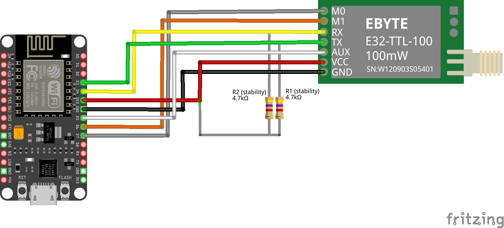

# LoRa ESP8266 Project
The receiver device will listen on specific transmission from a specified device address.

The transmitter device will use `fixed transmission` to send data to a specific listening
device (*receiver*).

## Pinout configuration
- `M0` and `M1` set to specific pins for dynamic adjustment ([configuring modes][4])

## Transmitter Schematic

  

### Circuit Board Rev1

  

## Receiver Schematic

  

## Resources
- [esp8266 Pinout Reference][1]
  - [Additional Pinout Reference][5]
- [E32 LoRa sx1278 Reference][2]
- [LoRa E32 Arduino Library GitHub][3]
- [Base64 Arduino Library GitHub][6]

[1]: https://randomnerdtutorials.com/esp8266-pinout-reference-gpios/
[2]: https://www.teachmemicro.com/e32-ttl-100-sx1278-lora-module/
[3]: https://github.com/xreef/LoRa_E32_Series_Library
[4]: https://www.teachmemicro.com/e32-ttl-100-sx1278-lora-module/#Configuring_Modes
[5]: https://www.electronicwings.com/nodemcu/nodemcu-gpio-with-arduino-ide
[6]: https://github.com/Xander-Electronics/Base64/